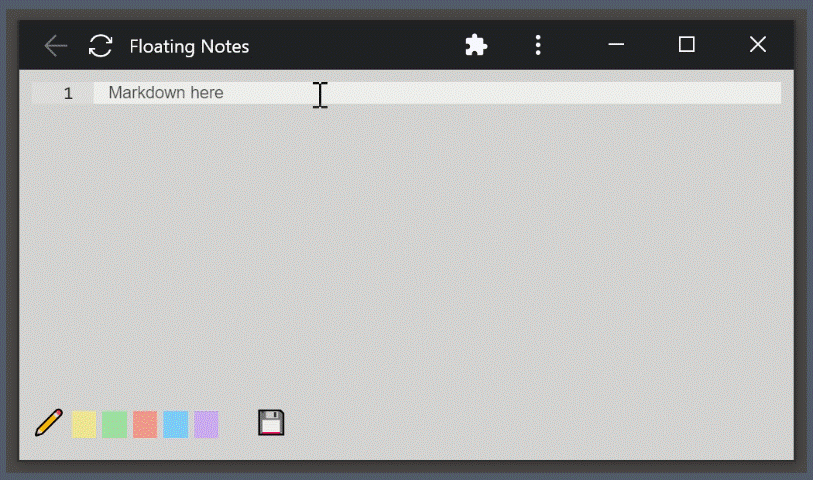

# Floating notes
Start a markdown note as quick as possible.
No worries about editors, workspaces, accounts etc.

## How to use

### Create a shortcut
Creating the shortcut not only gives a quick access,
but also start the app without distracting browser toolbars.
Optional but highly suggested

1. Go to https://urfdvw.github.io/floating-notes
2. Using chrome as example

3. Pin shortcut to system bar or dock

### How to use
1. click on the created shortcut
    - or go to https://urfdvw.github.io/floating-notes
2. Evething should be intuitive
3. [Ctrl-Enter] ([Cmd-Enter] on mac) to hide the editor

PS: You can keep note always on top on Windows 10+ with the help of
[PowerToy](https://learn.microsoft.com/en-us/windows/powertoys/)

## Tech involved
- Ace Editor for editor
- Zero-MD for rendering
