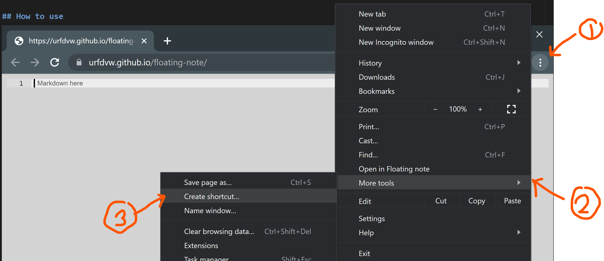

# Floating notes
What MS Sticky Notes should have been.

## How to use

### Create a shortcut
Creating the short cut not only gives a quick access,
but also start the app without distracting browser toolbars.
Optional but highly suggested

1. Go to https://urfdvw.github.io/floating-note
2. Using chrome as example

### How to use
1. click on the created shortcut
    - or go to https://urfdvw.github.io/floating-note
2. Start typing and it renders
3. [Ctrl-Enter] ([Cmd-Enter] on mac) to hide the editor
4. Click on the [Edit] button to back to editor

## Tech involved
- Ace Editor for editor
- Zero-MD for rendering
